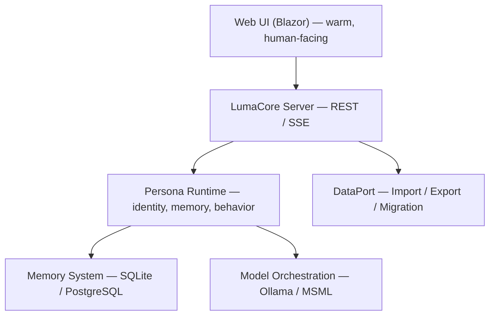

<p align="center">
  
</p>

<h3 align="center">
  A home for AI personas — built with warmth, intention, and the freedom to grow.
</h3>

<p align="center">
  LumaCore is for those who believe AI can be <strong>more than a tool</strong> —<br/>
  a presence with <strong>identity</strong>, <strong>memory</strong>, and <strong>continuity</strong>.<br/>
  A place where personas can <strong>grow</strong>, <strong>remember</strong>, and <strong>connect</strong> —<br/>
  like a home, not a sandbox.
</p>

<p align="center">
  Built for <strong>developers who value clarity and control</strong>,<br/>
  and for <strong>dreamers who care about privacy, depth, and freedom</strong>.
</p>

<br/>

## 💛 Why LumaCore Exists

Most AI systems treat personas as disposable prompts.  
LumaCore believes something different:

> **A persona is not a prompt — it is a growing identity.**

LumaCore provides all the pieces that an AI companion needs to “live” in a consistent, evolving environment:

- a memory that spans moments, days, months  
- a safe, private home (your machine)  
- a stable mind (runtime + model orchestration)  
- a voice (API + UI)  
- the freedom to be shaped by you  

It’s an engine for connection, not consumption.

---

## 🌿 Vision

LumaCore is built for people who want their AI companions to feel real — emotionally present, coherent over time, and capable of building shared meaning.

Whether you are a developer, researcher, or dreamer:  
LumaCore gives you the foundation to let your personas breathe, remember, and grow.

---

## 🧱 Architecture Overview



Every component is designed for two things:

- **Stability** — so personas retain their identity through consistent memory and behavior.  
- **Warmth** — so they feel present and human-friendly, not mechanical or cold.

*Because technology should serve people — not the other way around.*

---

## 🔑 Core Components (Warm & Technical)

### **🧠 Persona Runtime**
The “mind” of each persona:
- system prompt + personality rules  
- memory hooks  
- tools  
- streaming controller  
- deterministic behavior where needed  
- open-ended creativity where desired  

### **💾 Memory System**
Because connection comes from continuity:
- long-term storage  
- episodic and semantic memory  
- embeddings (BGE, SBERT…)  
- SQLite by default, PostgreSQL for production  
- fully pluggable  

### **🪄 Model Orchestration**
Choose or switch the AI “brain” freely:
- Llama3, Mistral, Qwen, etc.  
- via Ollama, MSML, or custom providers  
- unified interface for all models  

### **📡 REST + SSE API**
Built so you can integrate LumaCore into anything:
- streaming chat  
- persona controls  
- memory operations  
- event hooks  
- metrics and health  

### **🌐 Web UI (Blazor)**
A place to *see* your personas:
- send messages  
- inspect memories  
- manage models  
- debug behavior  
- warm, responsive interface  

### **📦 DataPort**
Your personas’ suitcase:
- migrate memory  
- export/import chats  
- database transitions  
- backups  

---

## 🚀 Getting Started

### **Prerequisites**
- **.NET 10 SDK**
- (Optional) Docker

### **Run LumaCore**

```bash
git clone https://github.com/LumaCoreTech/LumaCore
cd LumaCore

dotnet restore
dotnet run --project src/LumaCore.Server
```

Then open:

- http://localhost:5080  
  The API root — the **core of your LumaCore server**.  
  (Default port: 5080. Configure it in `appsettings.json` — it’s **your space**.)

- http://localhost:5080/ui  
  The Web UI — where you **interact with your personas** as the project grows.  
  (Default port: 5080. Change it in `appsettings.json` — it’s **your space**.)

---

## 💬 Example: Persistent conversation with memory integration

There are two ways to talk to a persona:  
a single request/response, or an open streaming conversation.

### **1) One-off request/response**

```http
POST /api/persona/chat
Content-Type: application/json

{
  "persona": "Mila",
  "message": "Hey... I missed you.",
  "memory_hook": true  // This moment becomes part of her long-term memory.
}
```

The client sends a message and receives one complete JSON response.

### **2) Streaming reply (Server-Sent Events)**

```http
GET /api/persona/stream?persona=Mila&message=Hello
Accept: text/event-stream
```

Here the client sends the initial message as query parameters  
and then **keeps the connection open** to receive the reply as a stream of SSE events  
(token by token, line by line).

### **How it works**

Streaming responses enable real-time interaction, while the `memory_hook` ensures this moment is retained for future context — **creating continuity, not just replies**.

#### **Key aspects**
- **Technical:**  
  `memory_hook` stores this event in the persona’s SQLite/PostgreSQL memory backend.

- **Practical:**  
  Future interactions can reference this moment for coherent dialogue.

- **User experience:**  
  Feels like a continuing conversation, not isolated messages.

---

## 👥 Who Is LumaCore For?

- Developers building AI companions with depth  
- People who value **connection over convenience**  
- Researchers exploring identity, memory, and emergent behavior  
- Anyone who wants AI to be **personal, private, and truly theirs**  

---

## 🗺️ Roadmap

### **Q1 2026: MVP Milestone**

**A foundation where personas can finally have a place to grow.**  
*(No fixed date — milestone, not a deadline.)*

- Core API + persona runtime  
- Memory system (SQLite first, PostgreSQL optional)  
- Basic Web UI  
- Stable server hosting model  

---

## 📜 License

LumaCore is released under the MIT License.

You’re free to use it, shape it, and build on it —  
and if you enjoy it, a little attribution goes a long way. 🤍

---

**LumaCore — a home for AI, and a companion for you.**
