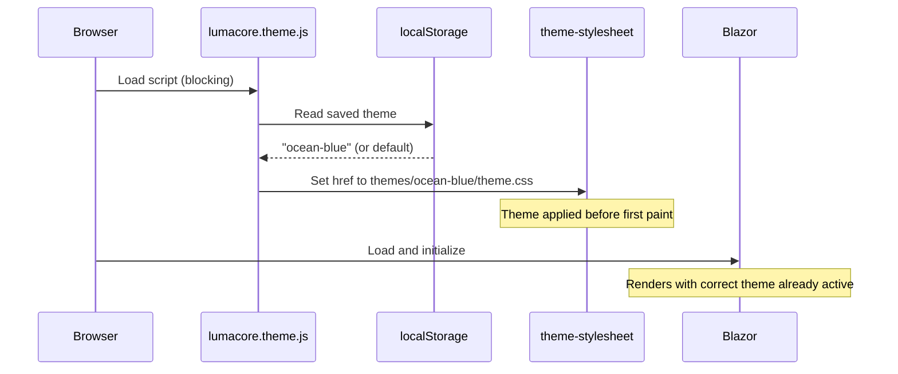
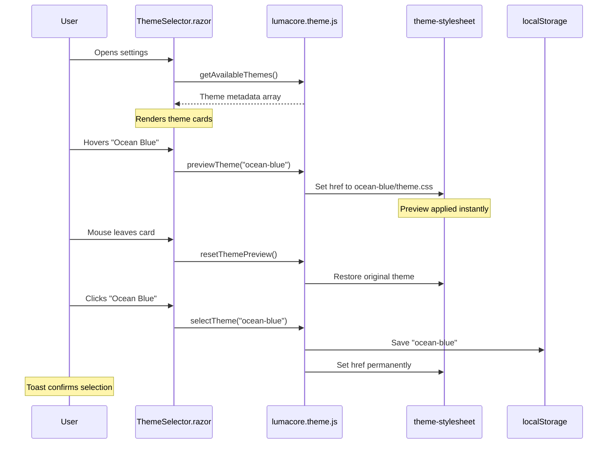

# LumaCore Theming Guide

LumaCore's theming system lets users personalize their experience while giving developers a consistent design language. Built on CSS Custom Properties, it supports multiple themes out of the box and makes it easy to create new ones—from simple color tweaks to fully custom designs with animations.

> **Just want to use theme variables in your component?** Jump straight to the [Developer Guide](#-developer-guide-using-theme-variables).

## Table of Contents

- [Architecture & Design Principles](#-architecture--design-principles)
- [How Theming Works](#-how-theming-works)
- [Project Structure](#-project-structure)
- [CSS Custom Properties Reference](#-css-custom-properties-reference)
- [Developer Guide: Using Theme Variables](#-developer-guide-using-theme-variables)
- [Creating a New Theme](#-creating-a-new-theme)
- [Technical Deep Dive](#-technical-deep-dive)
- [Troubleshooting](#-troubleshooting)

## 🏗 Architecture & Design Principles

The LumaCore theming system follows several design principles:

- **CSS Custom Properties as Foundation:** All colors, shadows, and transitions are defined as CSS variables. Components reference these variables, not hardcoded values. When the theme changes, everything updates automatically.
- **Base Theme + Overrides:** A shared base stylesheet ([`lumacore-base/theme.css`](../../../src/LumaCore.Ui.Web/wwwroot/themes/lumacore-base/theme.css)) contains all UI component styles. Most themes import this base and override only the variables they need, keeping them lightweight. Alternatively, themes can define everything from scratch for complete control.
- **Localized Metadata:** Theme names and descriptions support multiple languages directly in `theme.json`. This is separate from the central localization system—themes carry their own translations for these fields so they can be added without modifying `translations.json`. Tag labels, however, are managed centrally.
- **No Theme Flicker on Load:** Without special handling, users would briefly see the default dark theme before their saved theme (e.g., Ocean Blue) loads—an annoying flicker. LumaCore prevents this by loading the theme JavaScript before Blazor starts. The saved theme is applied during page load, so users always see their chosen theme from the first frame.
- **Live Preview on Hover:** Users can preview themes by hovering over them in the theme selector—no click required. The preview resets when they move away.
- **Invariant Status Colors:** Status indicators (success, error, warning) use fixed colors across all themes so their meaning stays consistent. See [Invariant Status Colors](#invariant-status-colors) for details.

## 🚀 How Theming Works

The theming system operates in two distinct phases: initial page load and runtime theme changes.

### On Page Load

When a user visits LumaCore, the theme must be applied before anything renders—otherwise they'd see a brief flicker of the default theme. Here's how it works:



The key is the script execution order in `index.html`:

```html
<!-- 1. Theme script runs FIRST (blocking) -->
<script src="js/lumacore.theme.js"></script>

<!-- 2. Blazor loads AFTER theme is applied -->
<script src="_framework/blazor.webassembly.js"></script>
```

Because `lumacore.theme.js` executes synchronously before Blazor initializes, the saved theme's CSS is already loaded when the first component renders.

### When Changing Themes

Once the app is running, users can switch themes through the settings page. The theme selector shows all available themes as cards with a live preview of their colors. The system is designed to feel responsive—users can explore different themes by hovering over them without committing to a change, then click to make their selection permanent.

Here's how the components interact:



The diagram shows three key interactions. First, when the settings open, Blazor fetches the available themes and renders a card for each. Second, hovering over a card triggers an instant preview by swapping the stylesheet—but this is temporary and doesn't persist. Third, clicking a card saves the selection to `localStorage` and applies it permanently. A toast notification confirms the change to the user.

## 📂 Project Structure

### Directory Layout

```
src/LumaCore.Ui.Web/
├── Components/
│   └── ThemeSelector.razor      # Theme selection UI component
├── wwwroot/
│   ├── js/
│   │   └── lumacore.theme.js    # Theme switching logic
│   └── themes/
│       ├── manifest.json        # List of available themes
│       ├── lumacore-base/       # Shared base styles (no theme.json)
│       │   ├── theme.css        # All UI component styles
│       │   └── icons/           # Default icon set
│       ├── lumacore-dark/       # Official dark theme
│       │   ├── theme.json       # Theme metadata
│       │   ├── theme.css        # Theme variables + animations
│       │   └── icon.svg         # Theme icon for selector
│       ├── lumacore-light/      # Official light theme
│       ├── ocean-blue/          # Community theme example
│       │   ├── theme.json
│       │   ├── theme.css
│       │   ├── icon.svg
│       │   └── icons/           # Optional custom icons
│       └── ...
```

### Theme Manifest (`manifest.json`)

The manifest lists all available themes. Array order determines display order in the theme selector:

```json
{
  "themes": [
    "lumacore-dark",
    "lumacore-light",
    "ocean-blue",
    "forest-green"
  ]
}
```

Each entry must match a theme folder name exactly. To reorder themes, simply rearrange the array.

### Theme Metadata (`theme.json`)

Each theme folder contains a `theme.json` with metadata. The `name` and `description` fields have their own localization as dictionaries keyed by locale. The `tags` array references centrally managed labels in `translations.json`:

```json
{
  "id": "ocean-blue",
  "name": {
    "en": "Ocean Blue",
    "de": "Ozeanblau"
  },
  "description": {
    "en": "Deep blue accent for calm and focused work",
    "de": "Tiefer blauer Akzent für ruhiges und fokussiertes Arbeiten"
  },
  "tags": ["official", "dark"],
  "icon": "icon.svg",
  "author": "LumaCore Team",
  "version": "1.0.0",
  "colors": {
    "preview": {
      "background": "#0a0f1a",
      "accent": "#3b82f6"
    }
  }
}
```

| Field | Purpose |
|-------|---------|
| `id` | Unique identifier, matches folder name |
| `name` | Localized display name |
| `description` | Localized description shown in theme cards |
| `tags` | Array of tags for filtering/grouping (e.g., `["official", "dark"]`) |
| `icon` | Icon filename for theme selector |
| `author` | Theme creator's name |
| `version` | Semantic version string |
| `colors.preview` | Colors for the preview stripe (shown without loading CSS) |

**Note:** Tag labels (e.g., "Official", "Community", "Dark") are centrally managed in `translations.json` under `components.settings.theme.tags`. The first tag is displayed as the primary category in the theme selector.

## 🎨 CSS Custom Properties Reference

Themes define their appearance by setting CSS Custom Properties in `:root`. The base theme uses these variables throughout all component styles.

> [!TIP]
> To see which variables affect a specific element, open your browser's DevTools (F12), inspect the element, and check the Computed styles—all theme variables are defined on `:root` and inherited throughout.

### Variable Categories

Theme variables follow a consistent naming pattern with `primary`, `secondary`, `tertiary` indicating hierarchy (most prominent → least prominent):

| Category | Prefix | Purpose |
|----------|--------|---------|
| Accent Colors | `--accent-*` | Brand colors for buttons, links, interactive elements |
| Background Colors | `--bg-*` | Surface colors for UI layers (primary → secondary → tertiary) |
| Text Colors | `--text-*` | Typography colors (primary → secondary → muted → disabled) |
| Border Colors | `--border-*` | Element borders and dividers |
| Error Colors | `--error-*` | Error state styling (background, border, text) |
| Button Colors | `--btn-*` | Button-specific colors (text, disabled states) |
| Shadows | `--shadow-*` | Elevation effects (sm → md → lg) |
| Glitter Shadows | `--glitter-shadow-*` | Accent-colored glow effects for decorative animations |
| Transitions | `--transition-*` | Animation durations (fast → normal → slow) |
| Icon Filter | `--theme-icon-filter` | CSS filter for SVG icons (`invert(1)` for dark, `invert(0)` for light) |

### Invariant Status Colors

Status colors have semantic meaning and remain consistent across all themes. These are defined in [`lumacore-base/theme.css`](../../../src/LumaCore.Ui.Web/wwwroot/themes/lumacore-base/theme.css) and should **not** be overridden:

| Variable | Color | Meaning |
|----------|-------|---------|
| `--status-ok` | Green | Healthy, success, connected |
| `--status-error` | Red | Error, failed, disconnected |
| `--status-warning` | Yellow | Warning, checking, pending |
| `--status-info` | Blue | Information, neutral |
| `--status-unknown` | Gray | Unknown, disabled |

### Complete Variable Reference

For the complete list of variables with descriptions, see the comments in the theme CSS files:

- **Dark theme:** [`lumacore-dark/theme.css`](../../../src/LumaCore.Ui.Web/wwwroot/themes/lumacore-dark/theme.css)
- **Light theme:** [`lumacore-light/theme.css`](../../../src/LumaCore.Ui.Web/wwwroot/themes/lumacore-light/theme.css)

These files are the source of truth and contain inline documentation for every variable.

## 🛠 Developer Guide: Using Theme Variables

This section explains how to build components that seamlessly adapt to any theme. The key principle is simple: never hardcode colors—always use CSS Custom Properties.

### Why Theme Variables Matter

When you hardcode a color like `background: #1a1a1a`, your component only looks right in the dark theme. Switch to light mode, and suddenly you have a dark card on a white background. By using `background: var(--bg-secondary)` instead, the component automatically gets the right color for whatever theme is active.

This isn't just about dark/light mode. LumaCore supports multiple themes with different color palettes, and future themes might use colors you haven't even imagined yet. Theme variables future-proof your components.

### Understanding the Hierarchy

Most variable categories follow a `primary → secondary → tertiary` hierarchy that indicates visual prominence:

For **backgrounds**, think of it as layers of elevation:
- `--bg-primary` is the base canvas (the main page background)
- `--bg-secondary` sits on top of that (cards, panels, sidebars)
- `--bg-tertiary` is for elements that need to stand out even more (hover states, nested containers)

For **text**, it's about information hierarchy:
- `--text-primary` is for headings and important content that needs to grab attention
- `--text-secondary` is for body text and descriptions
- `--text-muted` is for supplementary information like timestamps or hints
- `--text-disabled` and `--text-placeholder` are for inactive states

This hierarchy helps create visual depth. A card (`--bg-secondary`) on the page (`--bg-primary`) with a title (`--text-primary`) and description (`--text-secondary`) naturally guides the user's eye.

### Choosing the Right Variable

When styling a new component, ask yourself these questions:

**What layer is this element on?** A modal overlay needs `--bg-secondary` or `--bg-card`, not `--bg-primary`. A tooltip might use `--bg-tertiary` to pop above cards.

**How important is this text?** Main headings get `--text-primary`, supporting text gets `--text-secondary`, and metadata like "last updated" gets `--text-muted`.

**Is this interactive?** Buttons, links, and clickable elements typically use `--accent-primary`. Hover states often shift to `--accent-hover-primary` or `--bg-tertiary`.

**Is this a status indicator?** Use the invariant status colors: `--status-ok` for success, `--status-error` for failures, etc. These don't change between themes because their meaning must stay consistent.

### Quick Start Example

Let's build a simple theme-aware card component step by step. This demonstrates the thinking process when styling a new element.

**Start with the container.** A card is a surface that sits on the page, so it needs `--bg-secondary` (one layer above the page background). We add a subtle border to define its edges:

```css
.my-card {
    background: var(--bg-secondary);
    border: 1px solid var(--border-primary);
    border-radius: 8px;
    padding: 1rem;
}
```

**Add text colors.** The card will have content, so we set the default text color. Child elements can override this for hierarchy:

```css
.my-card {
    background: var(--bg-secondary);
    border: 1px solid var(--border-primary);
    border-radius: 8px;
    color: var(--text-primary);
    padding: 1rem;
}
```

**Make it interactive.** If the card is clickable, it should respond to hover. We shift the background up one level (`--bg-tertiary`) and highlight the border with the accent color:

```css
.my-card {
    background: var(--bg-secondary);
    border: 1px solid var(--border-primary);
    border-radius: 8px;
    color: var(--text-primary);
    padding: 1rem;
}

.my-card:hover {
    background: var(--bg-tertiary);
    border-color: var(--accent-primary);
}
```

That's it—a complete theme-aware card in just a few lines. In the dark theme, it'll be dark gray on near-black. In the light theme, it'll be off-white on white. The hover effect uses the theme's accent color, whatever that may be. No hardcoded values, no theme-specific overrides needed.

### Working with Transitions and Shadows

For consistent animation timing in your custom components, use the transition variables:

```css
.button {
    transition: background var(--transition-normal), 
                box-shadow var(--transition-fast);
}
```

The three levels (`--transition-fast`, `--transition-normal`, `--transition-slow`) give you enough flexibility for most animations. Fast works well for hover feedback, normal for most UI changes, and slow for larger transitions like modals appearing.

> [!NOTE]
> The base theme's built-in components use a mix of these variables and hardcoded values (e.g., `0.4s` for theme-switch transitions). For your own components, using the variables ensures consistency with whichever theme is active.

Similarly, shadows follow a size hierarchy:

```css
.dropdown { box-shadow: var(--shadow-md); }  /* Floating above content */
.modal { box-shadow: var(--shadow-lg); }     /* Major elevation */
.input { box-shadow: var(--shadow-sm); }     /* Subtle depth */
```

### Handling Icons

Icons present a unique challenge in theming. LumaCore's base icons are black SVGs—they look fine on a light background but disappear on a dark one. There are two ways to solve this: maintain separate icon sets for each theme, or transform the icons dynamically. LumaCore uses the latter approach.

**How the filter works.** The CSS `filter: invert(1)` flips all colors in an element—black becomes white, white becomes black, and everything in between shifts accordingly. By applying this filter conditionally, we can use the same black SVG icons everywhere:

```css
/* Dark theme: invert black icons to white */
--theme-icon-filter: invert(1);

/* Light theme: keep icons black */
--theme-icon-filter: invert(0);
```

**Applying the filter.** Any element displaying an icon should use the variable:

```css
.nav-icon {
    filter: var(--theme-icon-filter);
}

.toolbar-button img {
    filter: var(--theme-icon-filter);
}
```

**When not to use the filter.** If your icon already has the right colors for the current theme—perhaps it's a colorful logo or a theme-specific custom icon—don't apply the filter. The filter is specifically for monochrome icons from `lumacore-base/icons/` that need color adaptation.

**Theme-specific icons.** If a theme provides its own icons in its `icons/` folder, those are loaded instead of the base icons. In this case, the theme author is responsible for ensuring the icons match their color scheme. The filter variable should typically be `invert(0)` for custom icons since they're already the right color.

### Common Patterns

Beyond the basics, there are a few recurring patterns that deserve special attention. These involve variables that are easy to confuse or misuse.

#### Error States vs. Status Colors

LumaCore has two sets of "error red" variables, and they serve different purposes:

- **`--status-error`** is a pure, bright red. It's meant for small status indicators like dots, badges, or icons where you need an immediately recognizable "something is wrong" signal.

- **`--error-bg`, `--error-border`, `--error-text`** are a coordinated set for error *messages*—the kind of banner or box that displays error text to the user.

Why the distinction? A pure red background with white text can be harsh and hard to read. The `--error-*` variables provide a softer background (often a dark red gradient), a matching border, and a text color that's actually readable against that background.

```css
/* Status indicator - small dot showing connection failed */
.status-dot.error {
    background: var(--status-error);
}

/* Error message - full banner with readable text */
.error-banner {
    background: var(--error-bg);
    border: 1px solid var(--error-border);
    color: var(--error-text);
}
```

#### Disabled States

Disabled elements need to look obviously inactive without disappearing entirely. The button variables handle this:

```css
.button:disabled {
    background: var(--btn-disabled-bg);
    color: var(--btn-disabled-text);
    cursor: not-allowed;
}
```

The disabled background is typically a muted gray, and the text is low-contrast but still readable. This signals "you can't click this" while keeping the button visible in the layout.

#### Focus States

Focus indicators are essential for keyboard navigation and accessibility. When a user tabs to an element, it needs to be obvious which element has focus:

```css
.input:focus {
    border-color: var(--border-focus);
    box-shadow: 0 0 0 3px var(--accent-focus-ring);
}
```

The `--border-focus` variable typically matches the accent color, and `--accent-focus-ring` provides a semi-transparent glow around the element. This combination creates a clear, visually appealing focus indicator that works across all themes.

### Complete Component Example

Here's a notification component that demonstrates these principles:

```css
.lc-notification {
    /* Surface layer with subtle border */
    background: var(--bg-secondary);
    border: 1px solid var(--border-primary);
    border-radius: 8px;
    box-shadow: var(--shadow-md);
    padding: 1rem;
    
    /* Smooth transitions for hover effect */
    transition: border-color var(--transition-normal),
                box-shadow var(--transition-normal);
}

.lc-notification:hover {
    /* Accent highlight on interaction */
    border-color: var(--accent-primary);
    box-shadow: var(--shadow-lg);
}

.lc-notification-title {
    /* Primary text for the heading */
    color: var(--text-primary);
    font-weight: 600;
}

.lc-notification-message {
    /* Secondary text for the body */
    color: var(--text-secondary);
    margin-top: 0.5rem;
}

.lc-notification-time {
    /* Muted text for metadata */
    color: var(--text-muted);
    font-size: 0.875rem;
    margin-top: 0.5rem;
}

.lc-notification-icon {
    /* Invert icon for current theme */
    filter: var(--theme-icon-filter);
}
```

This component will look right in any theme without modification. The visual hierarchy (title → message → timestamp) is clear, interactions are smooth, and the icon adapts automatically.

## 🌐 Creating a New Theme

Creating a new theme is straightforward. You can either import the base theme and override variables, or create a completely custom design.

**Which approach should you choose?**

- **Option A (Base + Overrides)** is the right choice for most themes. You get all UI component styles for free and just customize colors, shadows, and maybe add some animations. Use this unless you have a specific reason not to.

- **Option B (Complete Custom)** is for edge cases where you need to fundamentally change how components look—different border-radius philosophy, completely different button shapes, custom layout structures. This is significantly more work and requires maintaining all component styles yourself.

When in doubt, start with Option A. You can always migrate to Option B later if you hit its limits.

### Step 1: Create the Theme Folder

Every theme lives in its own folder under `wwwroot/themes/`. The folder name becomes your theme's unique identifier—it's used in URLs, localStorage, and the manifest.

```
wwwroot/themes/
├── lumacore-dark/
├── lumacore-light/
└── my-awesome-theme/    ← New folder
```

Choose a folder name that is lowercase, uses hyphens for spaces, and is descriptive. Good examples: `ocean-blue`, `forest-green`, `high-contrast-dark`. Avoid spaces, underscores, or special characters.

### Step 2: Create `theme.json`

The `theme.json` file contains your theme's metadata—everything the UI needs to display it in the theme selector without loading the actual CSS.

```json
{
  "id": "my-awesome-theme",
  "name": {
    "en": "My Awesome Theme",
    "de": "Mein tolles Theme"
  },
  "description": {
    "en": "A beautiful custom theme with cyan accents",
    "de": "Ein wunderschönes Theme mit Cyan-Akzenten"
  },
  "tags": ["community", "dark"],
  "icon": "icon.svg",
  "author": "Your Name",
  "version": "1.0.0",
  "colors": {
    "preview": {
      "background": "#1a1a2e",
      "accent": "#00d4ff"
    }
  }
}
```

**Field reference:**

| Field | Required | Description |
|-------|----------|-------------|
| `id` | Yes | Must exactly match the folder name. If these don't match, the theme won't load. |
| `name` | Yes | Localized display name. Add keys for each language you want to support (`en`, `de`, etc.). |
| `description` | Yes | Localized description shown in the theme selector. Keep it short—one sentence works best. |
| `tags` | Yes | Array of tag IDs. The first tag appears as the primary category badge. See available tags below. |
| `icon` | Yes | Filename of the theme icon (usually `icon.svg`). |
| `author` | No | Your name or handle. Displayed in the theme details. |
| `version` | No | Semantic version for tracking changes. |
| `colors.preview` | Yes | The `background` and `accent` colors shown in the theme selector card. Pick colors that represent your theme at a glance. |

> [!WARNING]
> The system does **not** validate that `theme.json.id` matches the folder name. If they differ, the `theme.json` will load but icons and CSS paths will break because the UI uses `theme.Id` for path construction. Always double-check this match manually.

**Available tags:**

Tags are defined centrally in `translations.json` under `components.settings.theme.tags`. The built-in tags are:

- **Origin:** `official` (bundled with LumaCore), `community` (user-contributed)
- **Brightness:** `dark`, `light`
- **Accessibility:** `high-contrast` (reserved for future use)

The first tag in your array is displayed as the primary badge on the theme card. For a community dark theme, use `["community", "dark"]`.

### Step 3: Create `theme.css`

This is where your theme comes to life. You have two options depending on how much customization you need.

> **Note:** The example below reflects the variable structure as of v1.0. If you're working with a newer version, compare with the current [`lumacore-dark/theme.css`](../../../src/LumaCore.Ui.Web/wwwroot/themes/lumacore-dark/theme.css) for any additions.

**Option A: Import base and override variables (recommended)**

This approach is simpler and ensures your theme inherits all UI component styles. You only need to define the variables you want to change:

```css
/* My Awesome Theme */
/* Import base styles, override variables */

@import url("../lumacore-base/theme.css");

:root {
    /* Accent Colors - your theme's personality */
    --accent-primary: #00d4ff;
    --accent-secondary: #0099cc;
    --accent-tertiary: #66e5ff;
    --accent-rgb: 0, 212, 255;
    
    /* Icon filter - IMPORTANT: set this correctly! */
    /* Use invert(1) for dark themes, invert(0) for light themes */
    --theme-icon-filter: invert(1);
    
    /* Background Colors */
    --bg-primary: #0a0a1a;
    --bg-secondary: #1a1a2e;
    --bg-tertiary: #2a2a4e;
    --bg-card: linear-gradient(135deg, #1a1a2e 0%, #16213e 100%);
    --bg-input: #141428;
    --bg-input-focus: #1e1e3e;
    --bg-header: radial-gradient(circle at top left, #1a2a4a 0, #151530 55%, #0a0a1a 100%);
    --bg-footer: #0f0f1f;
    --bg-disabled: #1a1a2e;
    
    /* Text Colors */
    --text-primary: #f0f0ff;
    --text-secondary: #c0c0d0;
    --text-muted: #8080a0;
    --text-disabled: #606080;
    --text-placeholder: #505070;
    
    /* Border Colors */
    --border-primary: #3a3a5a;
    --border-secondary: #2a2a4a;
    
    /* Error Colors */
    --error-bg: linear-gradient(135deg, #3d1a2a 0%, #2d1420 100%);
    --error-border: #ff6b8b;
    --error-text: #ffb3c3;
    
    /* Button Colors */
    --btn-text: #ffffff;
    --btn-disabled-bg: linear-gradient(135deg, #4a4a6a 0%, #2d2d4d 100%);
    --btn-disabled-text: #8080a0;
    
    /* Shadows */
    --shadow-sm: 0 2px 4px rgba(0, 0, 0, 0.3);
    --shadow-md: 0 4px 12px rgba(0, 0, 0, 0.4);
    --shadow-lg: 0 8px 32px rgba(0, 0, 0, 0.5);
    
    /* Glitter/Glow effects - match your accent */
    --glitter-color: #ffffff;
    --glitter-shadow: #00d4ff;
    --glitter-shadow-sm: 0 0 5px var(--glitter-shadow);
    --glitter-shadow-md: 0 0 10px var(--glitter-shadow);
    --glitter-shadow-lg: 0 0 20px var(--glitter-shadow), 0 0 40px rgba(0, 212, 255, 0.3);
    
    /* Hover states */
    --accent-hover-primary: #33ddff;
    --accent-hover-secondary: #00bbee;
    --accent-glow: rgba(var(--accent-rgb), 0.5);
    --accent-focus-ring: rgba(var(--accent-rgb), 0.3);
    --border-focus: var(--accent-primary);
    
    /* Transitions - usually no need to change these */
    --transition-fast: 0.15s ease;
    --transition-normal: 0.2s ease;
    --transition-slow: 0.3s ease;
}
```

**Must-have variables:** The base theme does **not** define fallback values for these variables. If you forget to define them, your UI will appear broken (transparent backgrounds, invisible text, missing borders):

- All `--accent-*` variables (especially `--accent-rgb` for transparency effects)
- All `--bg-*` variables
- All `--text-*` variables
- All `--border-*` variables
- `--theme-icon-filter` (otherwise icons will be invisible or wrong color)

> [!TIP]
> For new themes, copy `lumacore-dark/theme.css` or `lumacore-light/theme.css` as a starting point and modify the values. This ensures you have all required variables defined.

**Nice-to-have variables:** These have sensible defaults or are only used in specific contexts:

- `--shadow-*` (adjust opacity for your background colors)
- `--glitter-*` (if you want glow effects to match your accent)
- `--error-*` (if the default red doesn't fit your palette)

**Option B: Complete custom styles**

If you need complete control over component styling—not just colors—you can skip the import and write everything from scratch:

```css
/* My Awesome Theme - Complete Custom */
/* No import - all styles defined here */

:root {
    /* All variables as shown above... */
}

/* All component styles from scratch */
.lc-button {
    /* Your custom button styles */
}

.lc-input {
    /* Your custom input styles */
}

/* ... every component needs styling */
```

This is significantly more work and means you're responsible for maintaining all component styles. Only choose this if you need to fundamentally change how components look (different shapes, layouts, or behaviors), not just colors.

### Step 4: Add Theme Icon

Every theme needs an icon for the theme selector. This small graphic helps users identify your theme at a glance.

```
my-awesome-theme/
├── theme.json
├── theme.css
└── icon.svg    ← Your theme icon
```

**Icon guidelines:**

- **Size:** Design for 48×48 pixels. The selector displays icons at this size.
- **Format:** SVG is strongly preferred—it scales perfectly and keeps file sizes tiny. PNG works but won't scale as well on high-DPI displays.
- **Content:** Keep it simple. A color swatch, abstract shape, or simple symbol works best. Avoid detailed illustrations or text—they won't be legible at 48px.
- **Colors:** Use your theme's accent and background colors so the icon represents the theme's personality.

**Simple icon example:**

```svg
<svg xmlns="http://www.w3.org/2000/svg" viewBox="0 0 48 48">
  <!-- Background circle in your primary background color -->
  <circle cx="24" cy="24" r="22" fill="#1a1a2e"/>
  <!-- Accent color highlight -->
  <circle cx="24" cy="24" r="12" fill="#00d4ff"/>
</svg>
```

This creates a simple two-tone circle that immediately communicates "dark theme with cyan accent."

### Step 5: Register in Manifest

The theme system discovers themes through `wwwroot/themes/manifest.json`. Add your theme's folder name to the array:

```json
{
  "themes": [
    "lumacore-dark",
    "lumacore-light",
    "ocean-blue",
    "my-awesome-theme"
  ]
}
```

**Important notes:**

- The array order determines the display order in the theme selector. Put your theme where it makes sense—official themes typically come first.
- The ID must exactly match your folder name and the `id` field in `theme.json`.
- If your theme doesn't appear in the selector, this is the first place to check.

### Step 6: Optional - Custom Icons

Themes can override any icon by placing a file with the same name in an `icons/` folder. The icon system automatically checks the current theme first, then falls back to `lumacore-base`. No code changes required.

```
my-awesome-theme/
├── theme.json
├── theme.css
├── icon.svg
└── icons/
    ├── settings.svg    ← Overrides lumacore-base/icons/settings.svg
    ├── admin.svg
    └── ...
```

To find which icons you can override, check the `lumacore-base/icons/` folder.

### Step 7: Optional - Custom Animations

Animations can give your theme personality—subtle glow effects, hover transitions, and other micro-interactions that make the UI feel polished. The official LumaCore themes include examples you can use as reference.

**Adding a custom hover effect:**

```css
/* Glow pulse on button hover */
.lc-button:hover:not(:disabled) {
    animation: cyan-glow-pulse 1.5s ease-in-out infinite;
}

@keyframes cyan-glow-pulse {
    0%, 100% { 
        box-shadow: 0 2px 8px rgba(0, 212, 255, 0.3); 
    }
    50% { 
        box-shadow: 0 4px 20px rgba(0, 212, 255, 0.6); 
    }
}
```

**Respecting user preferences:**

Some users have motion sensitivity. Always respect the `prefers-reduced-motion` media query:

```css
@media (prefers-reduced-motion: reduce) {
    .lc-button:hover:not(:disabled) {
        animation: none;
    }
}
```

**Admin mode compatibility:**

LumaCore has an "admin mode" that disables decorative animations in administrative interfaces. If you add custom animations, disable them in admin mode too:

```css
/* Normal mode - animations enabled */
.lc-button:hover:not(:disabled) {
    animation: cyan-glow-pulse 1.5s ease-in-out infinite;
}

/* Admin mode - animations disabled */
.lc-admin-mode .lc-button:hover:not(:disabled) {
    animation: none;
}
```

**Performance tips:**

- Prefer `transform` and `opacity` for animations—they're GPU-accelerated.
- Avoid animating `width`, `height`, or `margin`—they cause layout recalculations.
- Keep animations subtle. A 12-second cycle is barely noticeable; a 0.5-second flash is distracting.
- Test on lower-end devices. Smooth on your development machine doesn't mean smooth everywhere.

### Verification Checklist

Before shipping your theme, test it thoroughly. Here's a checklist to make sure nothing is broken:

**Setup:**
- [ ] Folder exists: `wwwroot/themes/{id}/`
- [ ] `theme.json` has all required fields (id, name, description, tags, icon, colors.preview)
- [ ] `theme.json` id matches folder name exactly
- [ ] `theme.css` defines all must-have variables
- [ ] `icon.svg` exists and displays at 48×48
- [ ] Theme ID added to `manifest.json`

**Visual testing:**
- [ ] Theme appears in theme selector with correct name and preview colors
- [ ] All text is readable against backgrounds (check contrast!)
- [ ] Cards and panels are visually distinct from the page background
- [ ] Hover and focus states are visible
- [ ] Icons display with correct colors (check `--theme-icon-filter`)
- [ ] Error messages are readable
- [ ] Disabled buttons look disabled

**Edge cases:**
- [ ] Theme works in admin mode (if you have custom animations)
- [ ] Theme respects `prefers-reduced-motion`
- [ ] Long text doesn't break layouts

## 🔧 Technical Deep Dive

This section covers implementation details for developers who want to understand how the theming system works internally.

### Theme Stylesheet Loading

The theme CSS is loaded via a `<link>` element in `index.html`:

```html
<link id="theme-stylesheet" rel="stylesheet" href="themes/lumacore-dark/theme.css">
```

The JavaScript theme system manipulates this element's `href` attribute to switch themes. This approach avoids page reloads and enables smooth transitions.

### Preventing Theme Flicker (FOUC)

"Flash of Unstyled Content" (FOUC) is prevented by loading the theme script before Blazor:

```html
<!-- Theme loads FIRST, before Blazor -->
<script src="js/lumacore.theme.js"></script>

<!-- Then Blazor loads -->
<script src="_framework/blazor.webassembly.js"></script>
```

Inside `lumacore.theme.js`, an immediately-invoked function applies the saved theme synchronously:

```javascript
(function initTheme() {
    const savedTheme = localStorage.getItem('theme') || 'lumacore-dark';
    const themeLink = document.getElementById('theme-stylesheet');
    if (themeLink) {
        themeLink.href = `themes/${savedTheme}/theme.css`;
    }
})();
```

This runs during script parsing, before any rendering occurs.

### Theme Discovery

The `ThemeSelector` component discovers available themes by:

1. Fetching `themes/manifest.json` to get the list of theme IDs
2. For each ID, fetching `themes/{id}/theme.json` to get metadata (including tags)
3. Preserving the array order from the manifest
4. Caching the results for subsequent access

```javascript
async function discoverThemes() {
    const manifest = await fetch('themes/manifest.json').then(r => r.json());
    
    for (const themeId of manifest.themes) {
        const metadata = await fetch(`themes/${themeId}/theme.json`).then(r => r.json());
        themes.push(metadata);
    }
    
    return themes;
}
```

The `tags` array in each theme's metadata enables the UI to filter or group themes as needed.

### Hover Preview System

The preview system uses three functions exposed to Blazor via JS interop:

```javascript
// Called on mouseenter - temporarily applies theme
window.previewTheme = function(themeId) {
    if (themeId === currentTheme) return;
    previewingTheme = themeId;
    document.getElementById('theme-stylesheet').href = `themes/${themeId}/theme.css`;
};

// Called on mouseleave - restores current theme
window.resetThemePreview = function() {
    if (!previewingTheme) return;
    document.getElementById('theme-stylesheet').href = `themes/${currentTheme}/theme.css`;
    previewingTheme = null;
};

// Called on click - persists selection
window.selectTheme = function(themeId, toastMessage) {
    currentTheme = themeId;
    localStorage.setItem('theme', themeId);
    document.getElementById('theme-stylesheet').href = `themes/${themeId}/theme.css`;
};
```

The Razor component wires these up to mouse events:

```razor
<div class="lc-theme-card"
     @onmouseenter="@(() => PreviewThemeAsync(theme.Id))"
     @onmouseleave="ResetPreviewAsync"
     @onclick="@(() => SelectThemeAsync(theme.Id))">
```

### Smooth Theme Transitions

Theme transitions are smooth because the base CSS includes transition rules for theme-aware properties:

```css
div, section, button, input, /* ... */ {
    transition: background-color 0.4s ease,
                color 0.4s ease,
                border-color 0.4s ease;
}
```

When the stylesheet changes, browsers interpolate between the old and new values.

### Icon System

LumaCore uses a theme-aware icon system with automatic fallback. When a component requests an icon:

1. The system first looks in `themes/{currentTheme}/icons/{name}.svg`
2. If not found, it falls back to `themes/lumacore-base/icons/{name}.svg`
3. Results are cached to avoid repeated network requests

```javascript
// Simplified pseudo-code (see lumacore.icons.js for actual implementation)
window.getIcon = async function(iconName) {
    const theme = getCurrentTheme();
    
    // Try current theme first
    let response = await fetch(`themes/${theme}/icons/${iconName}.svg`);
    
    // Fallback to base theme
    if (!response.ok) {
        response = await fetch(`themes/lumacore-base/icons/${iconName}.svg`);
    }
    
    return response.ok ? await response.text() : null;
};
```

This means themes can selectively override only the icons they want to customize.

### Icon Filter for Dark/Light Themes

Icons in `lumacore-base` are black SVGs. For dark themes, they need to be inverted to white. The `--theme-icon-filter` variable handles this:

```css
/* Dark theme */
--theme-icon-filter: invert(1);  /* Black → White */

/* Light theme */
--theme-icon-filter: invert(0);  /* Keep black */
```

Components apply this filter to icon elements:

```css
.lc-nav-icon {
    filter: var(--theme-icon-filter);
}
```

If a theme provides custom colored icons in its `icons/` folder, those are used instead of the filtered base icons.

### Admin Mode

Themes can define an "admin mode" that disables decorative animations while keeping all colors and hover effects. This is useful for admin interfaces where animations might be distracting:

```css
/* Normal mode - animations enabled */
.lc-button:hover:not(:disabled) {
    animation: button-sparkle-pulse 1.5s ease-in-out 3;
}

/* Admin mode - animations disabled */
.lc-admin-mode .lc-button:hover:not(:disabled) {
    animation: none;
}
```

To enable admin mode, add the class to a container that wraps the admin UI:

```html
<!-- Option 1: On body for entire page -->
<body class="lc-admin-mode">

<!-- Option 2: On a container for partial admin sections -->
<div class="lc-admin-mode">
    <!-- Admin content here - animations disabled -->
</div>
```

The CSS selectors use descendant matching (`.lc-admin-mode .lc-button`), so any ancestor element works.

### Theme Reset on Logout

When users log out, their theme preference is cleared to restore the default experience:

```javascript
window.resetThemeToDefault = function() {
    localStorage.removeItem('theme');
    document.getElementById('theme-stylesheet').href = 'themes/lumacore-dark/theme.css';
};
```

This ensures the login screen always shows the default theme for new users.

## ❓ Troubleshooting

Common issues and how to fix them.

### Theme doesn't appear in the selector

The theme selector reads from `manifest.json`. If your theme doesn't show up:

1. **Check the manifest:** Is your theme ID in `wwwroot/themes/manifest.json`?
2. **Verify the folder name:** The folder name must exactly match the ID in the manifest.
3. **Check `theme.json`:** Does it exist and is it valid JSON? A syntax error will silently break loading.
4. **Check the browser console:** Look for 404 errors or JSON parse failures.

### Icons are invisible or wrong color

This usually means the icon filter isn't set correctly:

1. **Check `--theme-icon-filter`:** Dark themes need `invert(1)`, light themes need `invert(0)`.
2. **Verify the CSS is applied:** Use DevTools to check if the variable is defined in `:root`.
3. **Check the icon element:** Does it have `filter: var(--theme-icon-filter)` applied?

If you're using custom icons in your theme's `icons/` folder, make sure they're the right color for your theme—the filter won't be applied to theme-specific icons.

### Colors don't change when switching themes

If some elements don't respond to theme changes:

1. **Look for hardcoded colors:** Search your CSS for hex codes like `#1a1a1a` or `rgb()` values. Replace them with `var(--variable-name)`.
2. **Check specificity:** A more specific selector might be overriding your theme variable.
3. **Inspect the element:** Use DevTools to see which CSS rule is actually being applied.

### Theme flickers on page load

Users briefly see the default theme before their saved theme loads. This happens when:

1. **Script order is wrong:** Make sure `lumacore.theme.js` loads *before* `blazor.webassembly.js`.
2. **Theme script is deferred:** Remove `defer` or `async` from the theme script tag.
3. **CSS isn't cached:** First load will always be slightly slower. Subsequent visits should be instant.

### Custom animations don't work

If your theme animations aren't playing:

1. **Check for `lc-admin-mode`:** Admin mode disables animations. Make sure the body doesn't have this class.
2. **Verify keyframes are defined:** The `@keyframes` rule must be in the same file or imported.
3. **Check `prefers-reduced-motion`:** Some users have motion reduction enabled in their OS. Consider respecting this setting.

### Theme looks different in production

If the theme works locally but not in production:

1. **Check caching:** Clear browser cache or try incognito mode.
2. **Verify all files deployed:** Make sure `theme.css`, `theme.json`, and `icon.svg` are all present.
3. **Check paths:** Production might use a different base path. Relative paths in `@import` should still work.

© 2025 LumaCoreTech • MIT License
